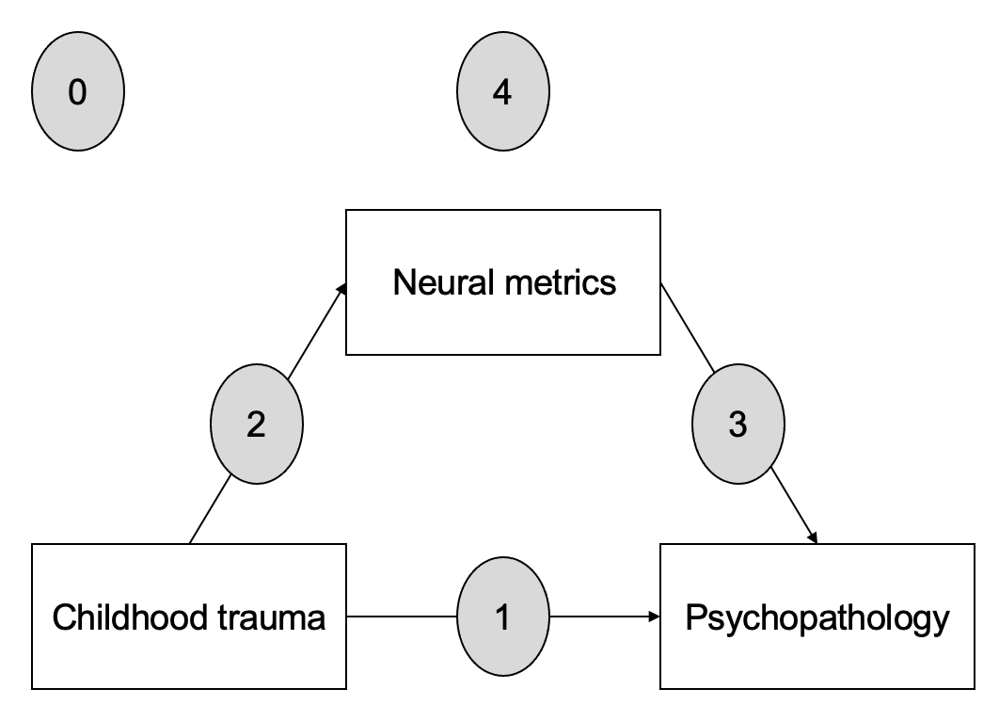

# dynamic-learning
Data and code from manuscript titled:    
**Dynamic alterations in neural networks supporting aversive learning in children exposed to trauma: Neural mechanisms underlying psychopathology**  
Stephanie N. DeCross, Kelly A. Sambrook, Margaret A. Sheridan, Nim Tottenham, & Katie A. McLaughlin  

Code is compatible with included R project. Code files are numbered in a way that groups similar analyses. Numbers correspond to the following:  
0: Code for plot creation and sociodemographics  
1: Analyses related to trauma predicting psychopathology  
2: Analyses related to trauma predicting neural metrics of activation and connectivity  
3: Analyses related to neural metrics predicting psychopathology  
4: Mediation analyses  

